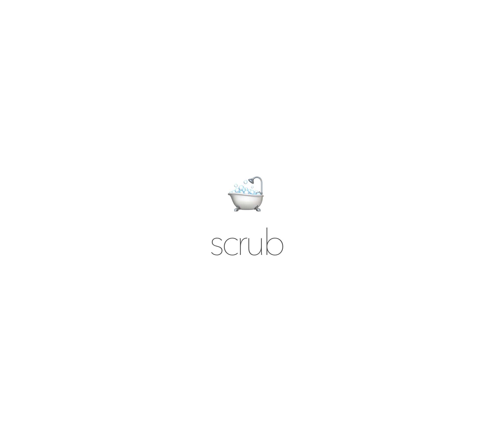

# Scrub

A Python library for cleaning sensitive data for production and normalizing data for testing.


```py
>>> from scrub import scrub_headers
>>> sensitive_headers = {
        "x-api-key": "--key--",
        "x-date": "--filtered--",
        "Set-Cookie": "--filtered--",
    }
>>> scrubber = scrub_headers(sensitive_headers)
>>> scrubber({
        "x-api-key": "3faf",
        "x-date": "Oct 18 2001",
        "Set-Cookie": "secret=3faf00",
        "Accept": "application/json",
    })
{
    'Accept': 'application/json',
    'Set-Cookie': '--filtered--',
    'x-api-key': '--key--',
    'x-date': '--filtered--'
}
>>>
```

## Quick Start

Install using pip/pipenv/etc. (we recommend [poetry](https://github.com/sdispater/poetry) for sane dependency management):

```
$ poetry add --dev scrub
```

Import a scrubber that you need:

```py
from scrub import scrub_headers scrub_body, scrub_request
```

### Available Scrubbers

`scrub_headers`

Scrubs HTTP headers, or more generally a plain python dict. Initialize with a key replacements dict:

```py
{
    "x-api-key": "--key--",
    "x-date": "--filtered--",
    "Set-Cookie": "--filtered--",
}
```


`scrub_body`

Scrubs HTTP body, or more generally any piece of text. Initialize with content matching replacement dict:

```py
{
    "<Secret>.*</Secret>": "<Secret>{}</Secret>".format(
        base64.b64encode(b"--filtered--").decode()
    ),
    "{.*}": "{}",
}
```

`scrub_request`

Scrubs a [requests](https://github.com/requests/requests) request. Give it headers and body scrubbers, or identity function if you don't want to replace anything there.

```py
from scrub import scrub_request
scrubber = scrub_request(headerscrubber, lambda x: x)

scrubber(req)
```


### Thanks:

To all [Contributors](https://github.com/jondot/scrub/graphs/contributors) - you make this happen, thanks!

# Copyright

Copyright (c) 2018 [@jondot](http://twitter.com/jondot). See [LICENSE](LICENSE.txt) for further details.